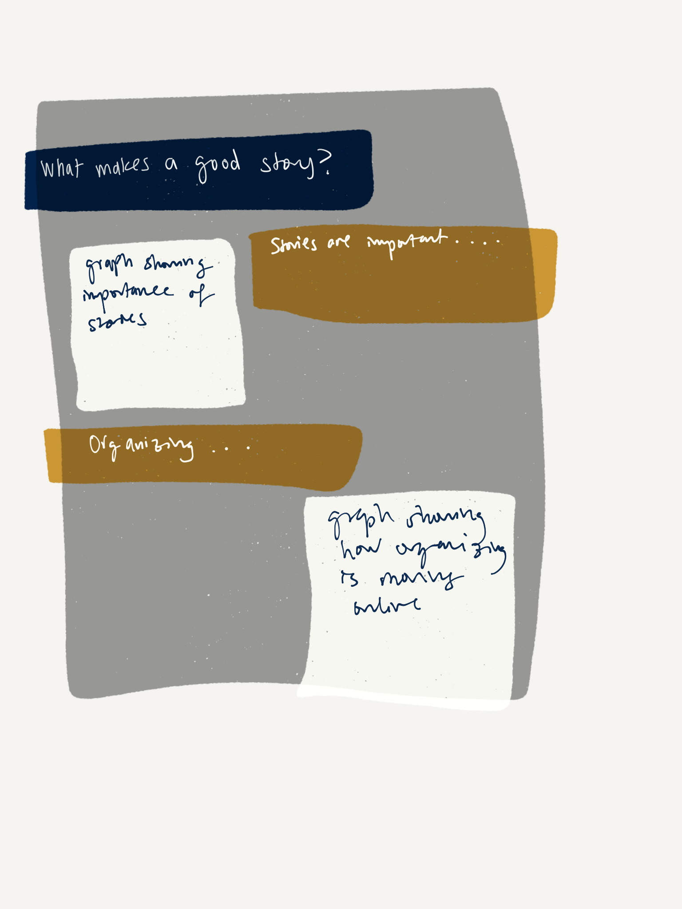
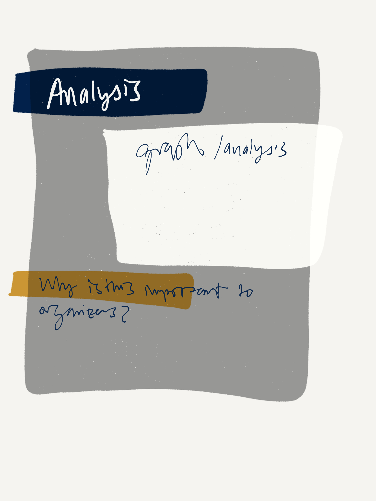
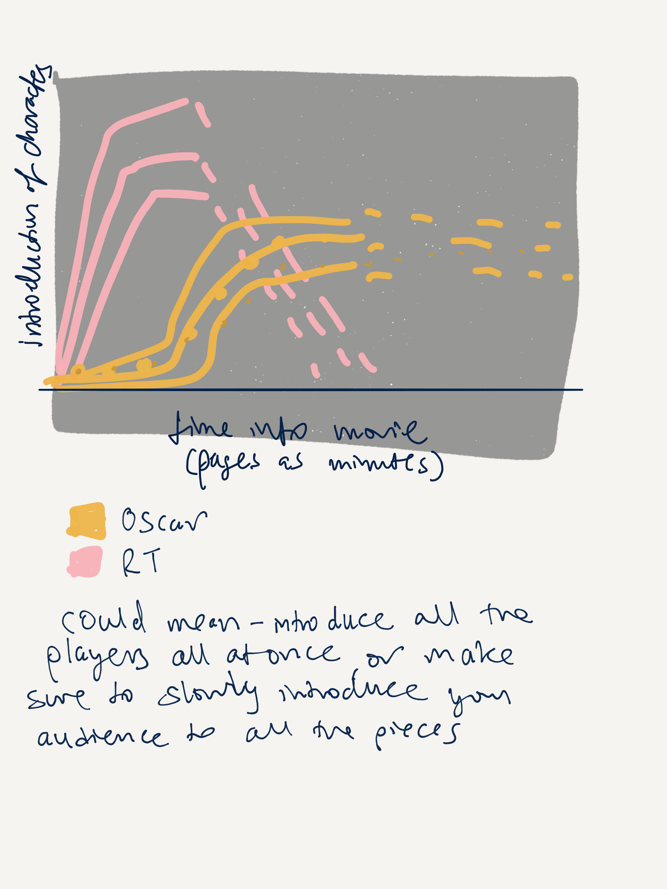
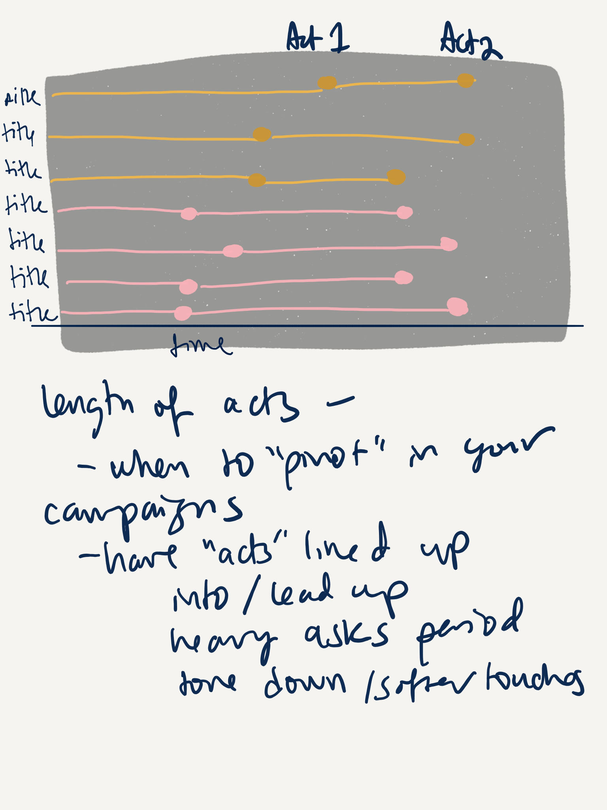
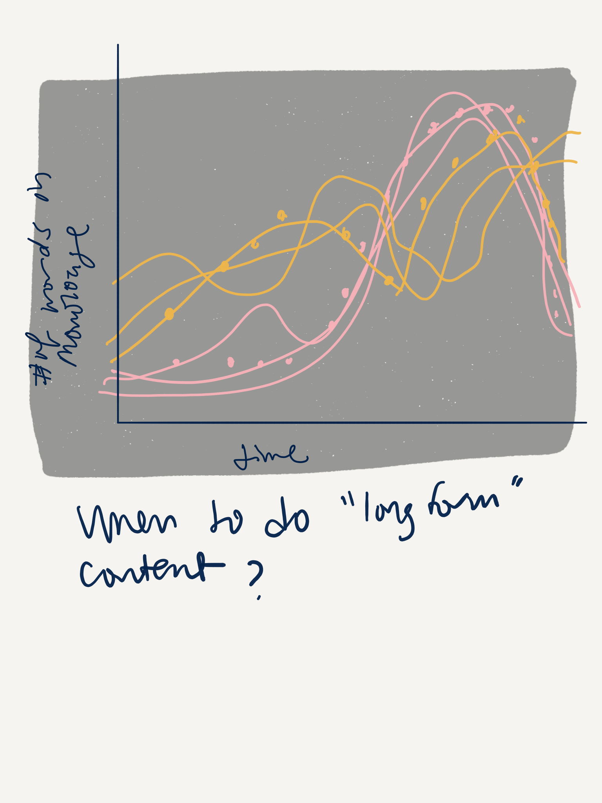

# What makes a good story? 

For my final project, I'd like to explore the age old question from the perspective of a data scientist - what makes a story good? 

Stories have been around since humans have been around, passed down from generation to generation, told around the campfire, theaters, movie screens, books - storytelling is what makes us human, what makes us connect with one another in our shared humanity. Stories are how we interact with each other, how we inherit legacies. And they are important for that reason alone. 

But they're also a powerful tool for organizing, for persuading. Organizers have known this forever, but the story we tell of a better world is how we attract people to the cause - get them to volunteer, knock doors, and donate. And digital organizers, especially, are tasked with connecting those on the ground with the larger mission and vision - a better world is possible, and we can build it. 

My love for stories is part of why I wanted to take this class, but I also wanted to explore something more - what makes a good story? It's not a new question - people have been asking it since stories themselves were created. Is it characters? Structure? Plot? Language? The right answer is, of course, some combination of all of those. And it's not just an existential question, either. If we can figure out what makes a good story, organizers would be able to use these arcs and these indicators to tell better stories and be able to get more people on board for all of the issues affecting our world right now - climate change, police brutality, and more. 

Since I started exploring this concept, I started consuming so much content on what exactly makes a good story. One of the books I picked up (through my screenwriting class last semester) was Syd Field's seminal work <i>Screenplay</i>. In it, Fields talks about the three act structure - the narrative arc of story, and how all good stories fit into that. 

So I was curious - does that hold up? And is there more that we can pull out, using data, that tells us what good stories look like? 

# Data and Output

For my dataset, I'm going to need to walk through a couple of different steps. Because this question is so broad, I want to make sure to really hone in on a very finite amount of data to make sure to not get lost in the question I'm asking. First, I want to focus on movies for now. Part of this is because the data for this is easier to find, and part of it is because screenplays are built around visual language more than they are text - which translates better, I think, to digital organizing in the real world. Second, I'll focus on two different indicators for what makes movies "good," by looking at a list of 2019 Oscar winners vs what was top on Rotten Tomatoes. 

Then, I'll put those names into [this website](https://imsdb.com/), and scrape the full script of that movie using a webscraping package like Beautiful Soup. This will be my main source of data, and I'll have to pull in other things like lists of common words, etc (which are easily found through a quick google search) so that I'm only focusing on unique words. I'll then use machine learning tools and the tool Voyant to look for patterns in the data that point to trends, but also look for patterns in the narrative structure of movies that work for viewers. 

If I have time, I'd like to add a section of looking at the narrative structure of certain campaigns (BLM, for example), but that's harder to find data for, and would only be if I had time and could easily replicate the work I've done for the previous part. 

Once I'm done, I'll present it in a Shorthand presentation. 

# Outline

My outline looks very similar to the way this write up is structured:

1) Why are stories important?
2) How does this translate to the real world/organizing? 
3) What makes a good story? (Lit review)
4) Overview of data 
5) Analysis
6) (Optional) Real world example 
7) Conclusion
8) Call to action - important to keep in mind narrative strucutre in organizing, not just language 

# Sketches

These are couple of the different ways that I'm hoping to show what's important to creating good stories and how they might translate to real world organizing.

### Story Format

### Examples of analysis

# Storyboards and Wireframes 

During the user research phase after the first part of this project, I decided to refocus onto Shakespeare plays instead of movie databases. The reasons for this was multi-fold: it was brought up that movies have a lot more to them than the script can identify (acting, props, music, etc) that would make them "good," and plays (especially Shakesperian plays, that usually played very minimal) have a lot less going on outside of the script; Shakespeare plays all follow a very basic 5 act structure that follows the structure of a digital campaign pretty well; and the data for Shakespeare plays tends to be a little easier to find pre-processed. Shakespeare plays also are usually seen as an "everyman" kind of play - he invented new, new ways of doing things, and iambic pentameter is always written about as holding the human heartbeat within its words. Given digital organizing's role as the "heartbeat" so to speak of issue campaigns, the parallel makes sense to draw. 

My question, however, was still a little opaque, and I wasn't entirely sure what really could be gleaned from the data I was able to find. So I ended up making a quick R Shiny dashboard where my users could play with the data and help me suss out different ways to visualize it or help me find connections I was missing. This is a hard question to ask, and a hard connection to make (between narrative structure of a play and digital organizing), so I needed a little help. 

<iframe src="https://satvika-neti.shinyapps.io/shakespearedata/", width: 100%; height: 500px;>

