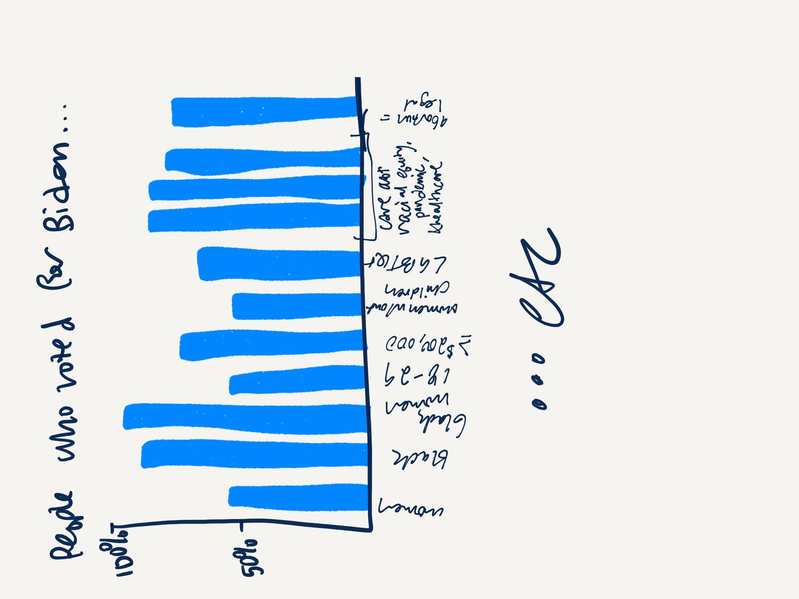
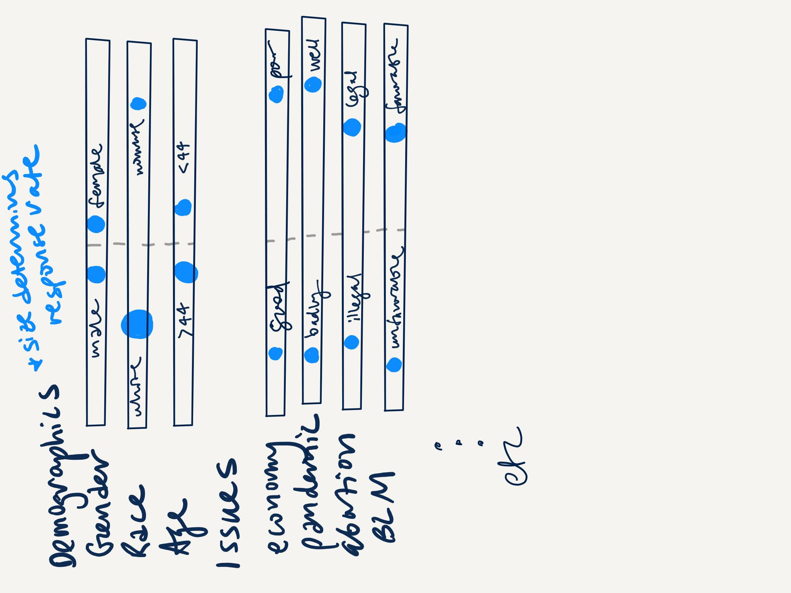

# First Assignment

For this data visualization critique, I chose to do a redesign of NBC's Georgia exit polls, [which can be found here](https://www.nbcnews.com/politics/2020-elections/georgia-president-results). 

# Critique 

I don't think these visualizations are bad, necessarily - I just think that they could tell a better story than they do now. 

Pros:
- like that the colors make it very clear who the data is talking about
- the format makes so much sense for who their readers are
- having the percentages of responses on the side was a great idea 

Cons:
- lots of scrolling to get to all the data
- hard to tell trends with the way the data is displayed (racial groups going from each one to "white" and "nonwhite" or age going twice)
- bars make it hard to discern where the numbers stop
- the way this is laid out, it's easy for your eye to focus on the blue because it's on the left, but harder to focus on the right

Mostly, this seems like a good way to simply display data that's better than a table, but by tweaking the story, we might be able to tell a better story. I think dot charts rather than the full bar graph might help isolate trends as well across groups. I want to split it by "people who voted for biden" and "people who voted for trump" to make the stories easier to follow. This would help pollsters or campaigners get a sense of who their voter profiles are. 

# Wireframing

First, I tried aggregating the question answers into one bar, using dots to showcase where the percentage was, and making the dots bigger based on how many respondents it had. With this version, we lost a lot of data since the most dots you can fit without it becoming overwhelming is 2. And I'm not sure that the making them bigger idea worked out well since most of them had a 50/50 split. 

The second I decided to split it entirely to build out a profile of who a Biden voter was. I like this one a little better, and I actually think you could flip the horizontal and vertical axis to make it look more like the original too. This loses data too, but also you gain an insight into who exactly a Biden voter is based on the largest percentage answers. 

# Feedback

I asked two of my friends some questions about these two wireframes. 

#### Can you tell me what you think this is?

1. I think that this is a visualization of the demographics of Georgia voters who voted for Biden
2. This looks like a visualization of Biden voters' answers at exit polls 

#### Can you describe to me what this is telling you?

1. This visualization is telling me that Biden voters polled in Georgia were overwhelmingly white, but fairly equally split in their perspectives on current issues. Additionally, the graph shows me that despite white voters making up the majority of Biden’s vote share, Black women as a demographic overwhelmingly voted for Biden.
2. This visualization is telling me why people voted for Biden (issues, demographics). 

#### Is there anything you find surprising or confusing?

1. I am surprised that only 50% of voters aged 18-29 voted for Biden, considering popular narratives about young voters being majority Democrats
2. Suprised about the high income bracket being the highest percentage for Biden. 

#### Who do you think is the intended audience for this?

1. I think the intended audience is individuals looking to better understand the demographics of voters in a swing state like Georgia. This visualization helps in comprehending the differences and similarities in voter demographics between Democratic and Republican voters. This could be a tool for political strategists to better assess where to focus funding and campaign efforts.
2. People who are interested in why people voted for Biden

#### Is there anything you would change or do differently?

1. I might clarify the title of the graph to reflect “percent of demographic voting for Biden...” to avoid confusion about how the graph is read
2. The dots make it hard to read what each dot means, maybe a line connecting them or a bar? 

# Final Product 
